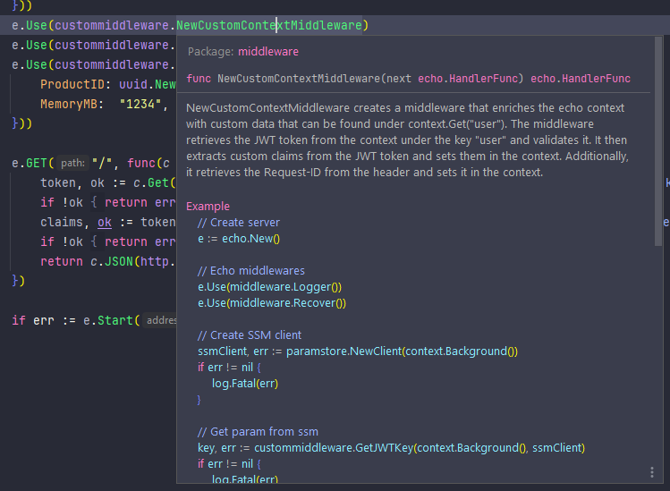

# Go Middlewares

In this package you will find all sharable middlewares for Echo framework.

## Available middlewares

|             | Audit | Custom Context | JWT Authorization | Timeout | Usage |
|-------------|-------|----------------|-------------------|---------|-------|
| Implemented | ✅     | ✅              | ✅                 | ✅       | ✅     |

## Usage examples

If you don't know how to implement some of middlewares take a look at examples:

- [Custom context, jWT, audit, usage](docs/examples/_jwt_context_audit_usage.go)
- [Timeout](docs/examples/_timeout.go)

Also you can take a look at code examples attached to documentation.
Highlight some middleware function and see examples:

## Running middlewares locally

If some of middleware use AWS libs (like JWT Authorization), to run it locally,
you need to start Docker container. Information about how to start such
container is located [here](../libs/aws/README.md).
